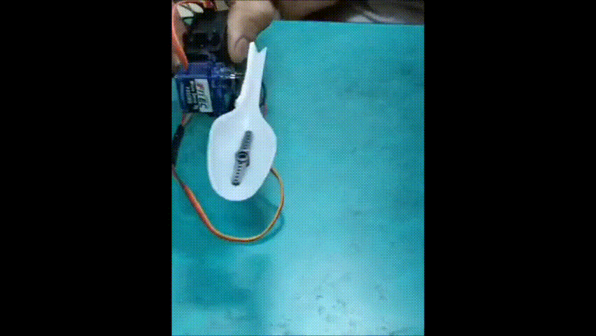
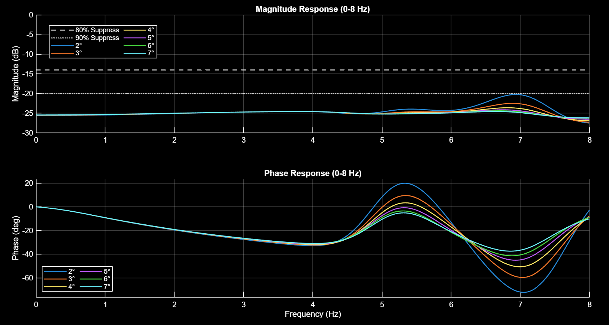
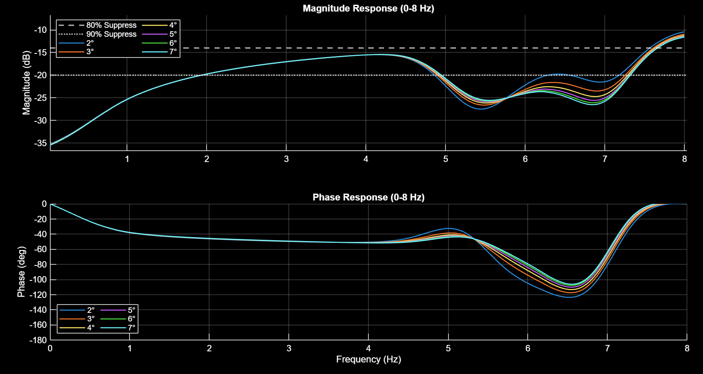
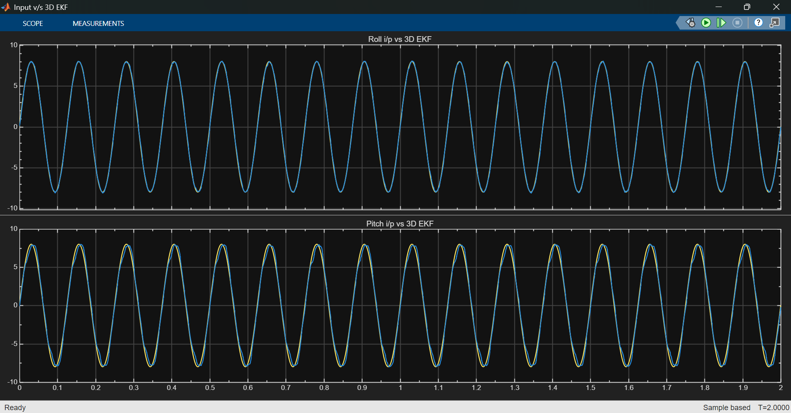
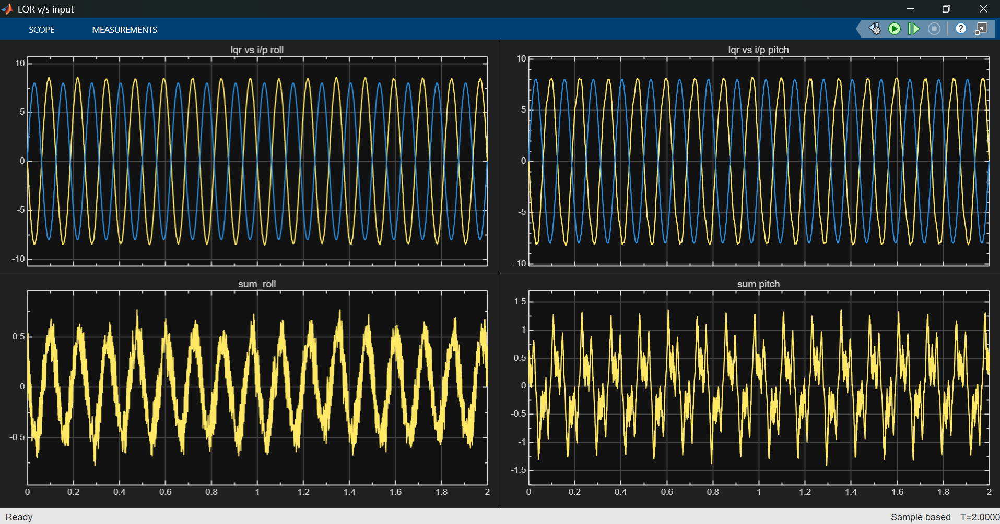

<div align="center">

# TremoSense

## Zephyr RTOS Based Tremor Suppression and Motion Stabilization Platform for Parkinson's Disease patients

<table>
<tr>
<td width="42%" align="center">
  
</td>
<td width="1%"></td>
<td width="57%" align="center">
  
</td>
</tr>
</table>w

<p align="center">
  
  
  
</p>

</div>

---

## ✨ Abstract

TremoSense is a real-time embedded motion stabilization platform built on **Zephyr RTOS** and the **Seeed XIAO nRF52840 Sense**. The system combines inertial sensing, **Extended Kalman Filter (EKF) state estimation, Linear Quadratic Regulator (LQR)** control, and servo actuation to suppress tremor-induced motion. Parkinson's Disease patients generally suffer from tremors in the range of **3 to 7 Hz**, due to which they face problems in daily like tasks, like **holding a spoon**, which we aim to solve by means of this project.  

The project operates in 2 stages:
1. An **Extended Kalman Filter (EKF)** performs motion estimation and noise reduction and determines the spoon's present orientation (specifically roll and pitch angles) and provides them to the LQR.
2. A **Linear Quadratic Regulator (LQR)-based controller** computes optimal compensatory control signals in real time. These control inputs drive a **two-axis servo-actuated gimbal mechanism** that generates counter-directional motion to attenuate tremor-induced displacement and improve spoon stability during assistive feeding operations, in the Roll & Pitch directions. 

The EKF-LQR control architecture was validated at 1000 Hz in MATLAB/Simulink and deployed on the nRF52840 using Zephyr RTOS.

---

## 🎯 Objectives

* Real-time acquisition and monitoring of hand motion dynamics
* Identification and characterization of tremor frequency and amplitude
* Generation of active counter-motion for tremor attenuation
* Enhancement of utensil stability during assistive feeding tasks
* Facilitation of future clinician-oriented reporting and patient monitoring capabilities

---

## 🧰 Hardware Configuration

* **Seeed XIAO nRF52840 Sense** for embedded processing and onboard IMU sensing
* **MG995 Servo** for roll-axis stabilization
* **FS90MG Servo** for pitch-axis stabilization

---

## 💻 Software Stack and Development Environment

* **Zephyr RTOS** for embedded firmware architecture and hardware abstraction
* **MATLAB & Simulink** for control-system modeling, simulation, and analytical validation


### Firmware Architecture

* **Multi-threaded Zephyr RTOS** application architecture
* Inter-thread communication using **Zephyr message queues**
* Synchronization using **Zephyr semaphores**
* Real-time sensor acquisition, estimation, control, and actuation tasks

## Required Libraries and Installation

### Operating System Support

The project development environment has been configured and tested to build on:

* **Ubuntu 22.04 LTS**

### Zephyr RTOS Installation and Setup

The following setup procedure installs the Zephyr RTOS workspace, SDK, ARM toolchain, Python dependencies, and development utilities required for building and flashing the TremoSense firmware.

**1. Install Zephyr RTOS**

Follow the instructions [here](https://docs.zephyrproject.org/latest/develop/getting_started/index.html) till [this section](https://docs.zephyrproject.org/latest/develop/getting_started/index.html#get-zephyr-and-install-python-dependencies)

**2. Installing the Zephyr SDK**

Currently this project uses XIAO BLE Sense board which has nRF52840 SoC onboard it which requires GNU ARM toolchain. To optimize the installation of Zephyr SDK
and reduce disk usage we can install the GNU ARM toolchain specifically, using:
```bash
west sdk install -t arm-zephyr-eabi
```
Otherwise,
```bash
west sdk install
```
installs all toolchains.

**3. Install the Tremosense Application**

```bash
cd ~/zephyrproject
git clone https://github.com/rkt-1597/TremoSense-Project
cd TremoSense-Project/tremosense-app
```

**4. Build the Tremosense Application**

```bash
west build -b xiao_ble/nrf52840/sense -p always -- -DDTC_OVERLAY_FILE=boards/xiao_ble.overlay -DCONF_FILE=boards/xiao_ble.conf
```

**5. Flash the Tremosense Application**

Now, double-click on the XIAO BLE Sense board and copy the file `zephyr.uf2` to XIAO-SENSE directory; board will reset immediately and start running the application. <username> is your Linux username, which can be found uinsg `whoami` command.
```bash
cp -r ~/zephyrproject/TremoSense-Project/tremosense-app/build/zephyr/zephyr.uf2 /media/<username>/XIAO-SENSE
```
**Note:**
Just after flashing, make sure to hold the board horizontally levelled since it immediately starts calibration processs for the IMU. It will switch on onboard blue LED for 3 seconds before beginning calibration and after calibration, it will 
blink the blue LED for 5 seconds; the obtained offsets will be available on console during this time. Immdiately after this the servos will be activated for tremor cancellation.

---

## 🚀 Future Scope

* Integration of servo dynamics and actuator non-linearities into the control model
* Adaptive or gain-scheduled control for improved tremor suppression across varying user conditions
* Quantitative hardware benchmarking using IMU-based performance metrics
* Prototype miniaturized and ergonomically optimized mechanical design for daily use
* Design of a robust and power efficient battery and power management system for making the prototype portable
* Closed-loop evaluation on varied multi-axis stabilization platforms
---

## MATLAB & Simulink Modelling Results

The following tests have been done considering mass of food to be 50 grams, and using FS90MG for Pitch axis control & MG995 for Roll axis control

* ### **Roll Axis Frequency Analysis**



*Frequency-response analysis of the roll stabilization axis under tremor amplitudes ranging from 2° to 7° indicates that the controller maintains >90% tremor suppression across most of the clinically relevant tremor band (3–7 Hz). For this test, the model was provided a Roll tremor signal with variable frequency sweep and amplitude (representing Roll angle) varying from 2 to 7 with step size of 1 and Pitch and Yaw tremor signals being sine waves of amplitude 8 (i.e. 8° of anglular displacement along that axis) & frequency of 8 Hz; this helps to obtain the frequency analysis of Roll axis taking into account cross-coupling among the axes.*

* ### **Pitch Axis Frequency Analysis**

*Frequency-response analysis of the pitch stabilization axis under tremor amplitudes ranging from 2° to 7° demonstrates stable tremor suppression across most of the clinically relevant tremor band (3–7 Hz) - >80% tremor suppression. For this test, the model was provided a Pitch tremor signal with variable frequency sweep and amplitude (representing Pitch angle) varying from 2 to 7 with step size of 1 and Roll and Yaw tremor signals being sine waves of amplitude 8 (i.e. 8° of anglular displacement along that axis) & frequency of 8 Hz; this helps to obtain the frequency analysis of Pitch axis taking into account cross-coupling among the axes.*

* ### **EKF vs Input**

*Time-domain comparison between simulated 8 degree (across roll and pitch axis separately) and 8 Hz tremor input and EKF state estimate reveals the estimator accurately tracks tremor motion with minimal amplitude distortion and phase lag, providing reliable state information for closed-loop control.*


* ### **LQR vs Input**

*Time-domain response of the LQR controller shows the generated control action produces counter-motion that opposes the measured tremor, resulting in significant attenuation of residual motion in the stabilized output. The residual tremor RMS was 0.346° for the roll axis and 0.573° for the pitch axis under an 8° amplitude, 8 Hz tremor input across all 3 axes - Roll, Pitch & Yaw*

## Tuning the project for specific use case

The project has several tunable parameters which can be tuned to best suit the hardware used (e.g. different servo motors used, spoon of different length used, etc.) and to best tailor the project for specific application, tune the following parameters before building the `tremosense-app/` application:

* Tune the EKF by adjusting Q_EKF (process noise covariance) and R_EKF (measurement noise covariance) according to sensor characteristics and application requirements, by setting values of `Q_EKF` & `R_EKF` in the model simulation (refer EKF block in [`MATLAB_Simulink/TremoSense_Model.pdf`](MATLAB_Simulink/TremoSense_Model.pdf))
* Set the physical system parameters and controller weights in  [`MATLAB_Simulink/LQR_ARE.m`](MATLAB_Simulink/LQR_ARE.m) and run the script to obtain the `K_lqr` matrix
* Set the constants in [`tremosense-app/include/constants.h`](tremosense-app/include/constants.h) and `K_lqr` matrix obtained from previous step

## 👥 Project Contributors

<div align="center">

**Prithvi Tambewagh** · **Pawan Shinde** · **Pranshu Kumar**<br>
B.Tech. Electronics and Telecommunication Engineering<br>
Veermata Jijabai Technological Institute (VJTI), Mumbai, India<br>

</div>