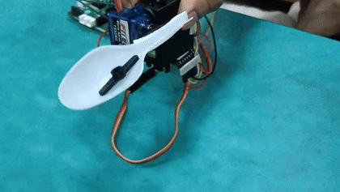

<div align="center">

# <span style="font-size:5rem; font-weight:900; letter-spacing:0.5px;">TremoSense</span>

### Adaptive Tremor Suppression and Motion Stabilization Platform

<table>
<tr>
<td width="42%" align="center">
  
</td>
<td width="1%"></td>
<td width="57%" align="center">
  
</td>
</tr>
</table>

<p align="center">
  
  
  
</p>

</div>

---

## ✨ Abstract

Neurological disorders such as Parkinson’s disease and essential tremor can impair fine motor activities including eating and object manipulation. TremoSense is a low-cost embedded tremor compensation platform that uses inertial sensing, signal processing, EKF-LQR-based feedback control, and servo actuation to reduce tremor-induced motion in real time. The system is also designed to support future tremor analytics through patient motion recording and computational assessment of tremor characteristics.

---

## 🎯 Objectives

* Real-time acquisition and monitoring of hand motion dynamics
* Identification and characterization of tremor frequency and amplitude
* Generation of active counter-motion for tremor attenuation
* Enhancement of utensil stability during assistive feeding tasks
* Development of a scalable tremor data acquisition and analysis framework
* Facilitation of future clinician-oriented reporting and patient monitoring capabilities

---

## ⚙️ Operating Principle

The TremoSense platform integrates inertial sensing, signal processing, state estimation, feedback control, and servo-based actuation into a closed-loop tremor compensation system. The onboard IMU continuously acquires multi-axis hand motion data, which is digitally filtered to isolate pathological tremor-frequency components, typically within the 3–8 Hz range. An Extended Kalman Filter (EKF) performs motion estimation and noise reduction, while a Linear Quadratic Regulator (LQR)-based controller computes optimal compensatory control signals in real time.

These control inputs drive a two-axis servo-actuated gimbal mechanism that generates counter-directional motion to attenuate tremor-induced displacement and improve spoon stability during assistive feeding operations.

---

<!-- Place the following files in your repository under /assets for GitHub rendering:
- assets/zephyr.png
- assets/tremgif.gif
-->

## 🧰 Hardware Configuration

* **Seeed XIAO nRF52840 Sense** for embedded processing and onboard IMU sensing
* **Arduino Uno** for auxiliary development and hardware interfacing
* **Micro servo motors** for two-axis stabilization control
* **Rechargeable battery subsystem** for portable operation
* **Lightweight mechanical spoon mounting assembly**
* **USB interface** for debugging, telemetry, and data acquisition

---

## 💻 Software Stack and Development Environment

* **Zephyr RTOS** for embedded firmware architecture and hardware abstraction
* **Arduino IDE** for rapid prototyping and peripheral testing
* **MATLAB** for control-system modeling, simulation, and analytical validation

### Required Libraries and Installation

#### Operating System Support

The project development environment has been configured and tested on:

* **Windows 10 / 11**
* **Ubuntu Linux 22.04+**

#### Zephyr RTOS Installation and Setup

The following setup procedure installs the Zephyr RTOS workspace, SDK, ARM toolchain, Python dependencies, and development utilities required for building and flashing the TremoSense firmware.

##### Windows Installation

**1. Install Required Dependencies**

Install the following software before proceeding:

* Python 3.12+
* Git
* CMake
* Ninja
* Visual Studio Code (recommended)
* Zephyr SDK

Using Chocolatey (recommended):

```bash
choco install git cmake ninja python
```

After installation, restart the terminal and verify:

```bash
python --version
git --version
cmake --version
ninja --version
```

**2. Create the Workspace and Virtual Environment**

```bash
mkdir C:\tremosense-zephyr
cd C:\tremosense-zephyr
python -m venv .venv
.venv\Scripts\activate
```

**3. Install West and Pull the Zephyr Source Tree**

```bash
pip install west
west init
west update
west zephyr-export
pip install -r zephyr\scripts\requirements.txt
```

**4. Install the Zephyr SDK and ARM Toolchain**

Extract the Zephyr SDK into the workspace directory and run:

```bash
cd zephyr-sdk-1.0.1
setup.cmd
cd ..
```

**5. Verify Zephyr Installation**

```bash
west boards
```

##### Linux Installation (Ubuntu 22.04+)

**1. Install Required System Dependencies**

```bash
sudo apt update
sudo apt install -y git cmake ninja-build gperf \
ccache dfu-util device-tree-compiler wget \
python3-dev python3-pip python3-setuptools python3-tk python3-venv xz-utils file make gcc gcc-multilib
```

**2. Create the Workspace and Virtual Environment**

```bash
mkdir ~/tremosense-zephyr
cd ~/tremosense-zephyr
python3 -m venv .venv
source .venv/bin/activate
```

**3. Install West and Pull the Zephyr Source Tree**

```bash
pip install west
west init
west update
west zephyr-export
pip install -r zephyr/scripts/requirements.txt
```

**4. Install the Zephyr SDK and ARM Toolchain**

```bash
cd ~/tremosense-zephyr
wget https://github.com/zephyrproject-rtos/sdk-ng/releases/download/v1.0.1/zephyr-sdk-1.0.1_linux-x86_64.tar.xz

tar xvf zephyr-sdk-1.0.1_linux-x86_64.tar.xz
cd zephyr-sdk-1.0.1
./setup.sh -t arm-zephyr-eabi -h -c
cd ..
```

**5. Verify Zephyr Installation**

```bash
west boards
```

#### Arduino IDE Libraries

Install the following libraries using the Arduino Library Manager:

```text
Adafruit MPU6050
Adafruit Unified Sensor
ArduinoFFT
Servo
```

#### MATLAB Toolboxes

* Control System Toolbox
* Signal Processing Toolbox
* System Identification Toolbox

---

## 🚀 Future Scope and Research Directions

* Adaptive control strategies for improved real-time tremor compensation
* Longitudinal tremor recording and patient-specific motion analytics
* Machine learning-based tremor characterization and severity estimation
* Automated clinician-oriented tremor analysis and reporting
* Ergonomically optimized lightweight enclosure for daily usability

---

## 👥 Project Contributors

<div align="center">

**Prithvi Tambewagh** · **Pawan Shinde** · **Pranshu Kumar**<br>
Department of Electronics and Telecommunication Engineering<br>
Veermata Jijabai Technological Institute (VJTI), Mumbai, India<br>

</div>

---

## 📄 License

This project is licensed under the **GNU General Public License v3.0 (GPL-3.0)**.
