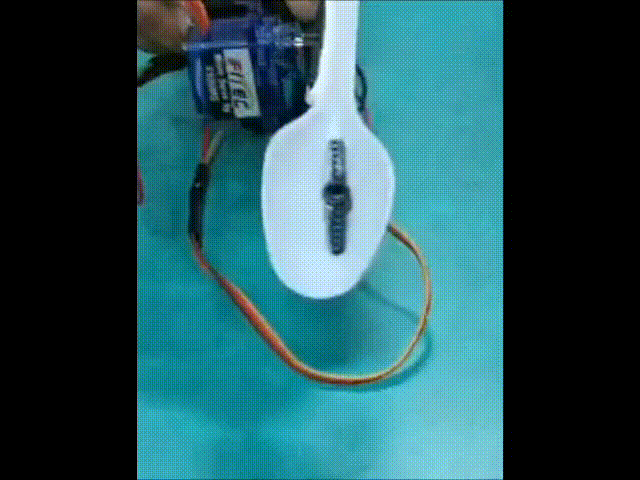
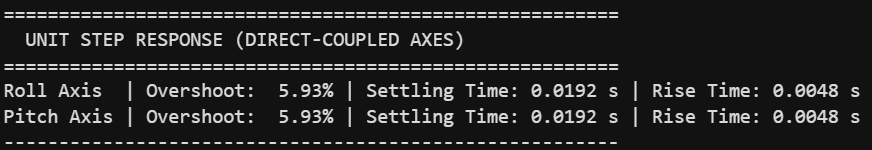
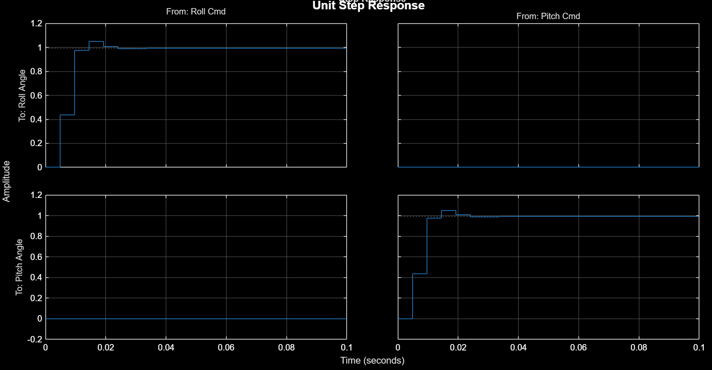
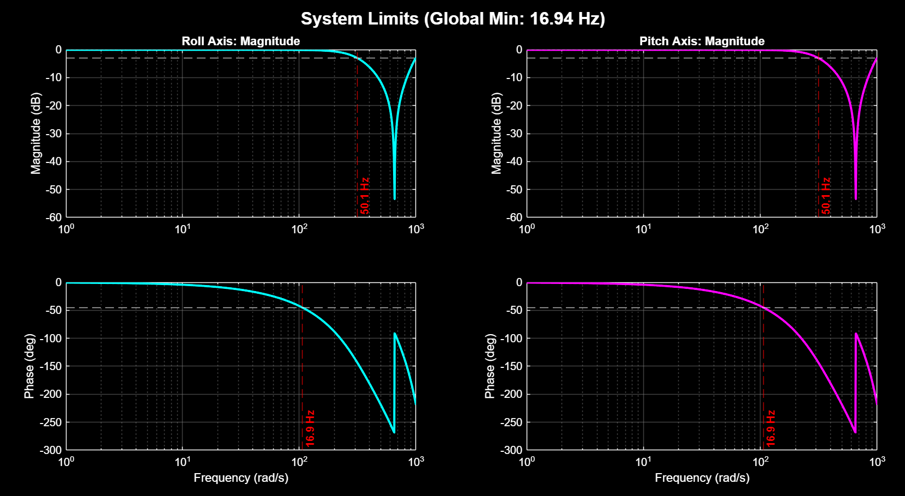
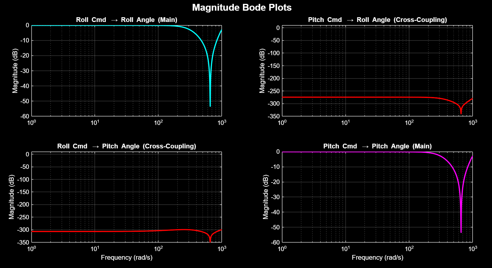
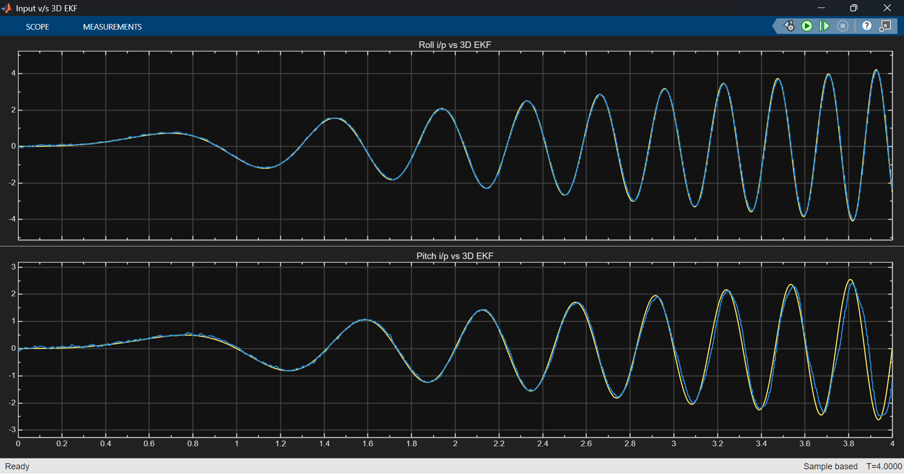
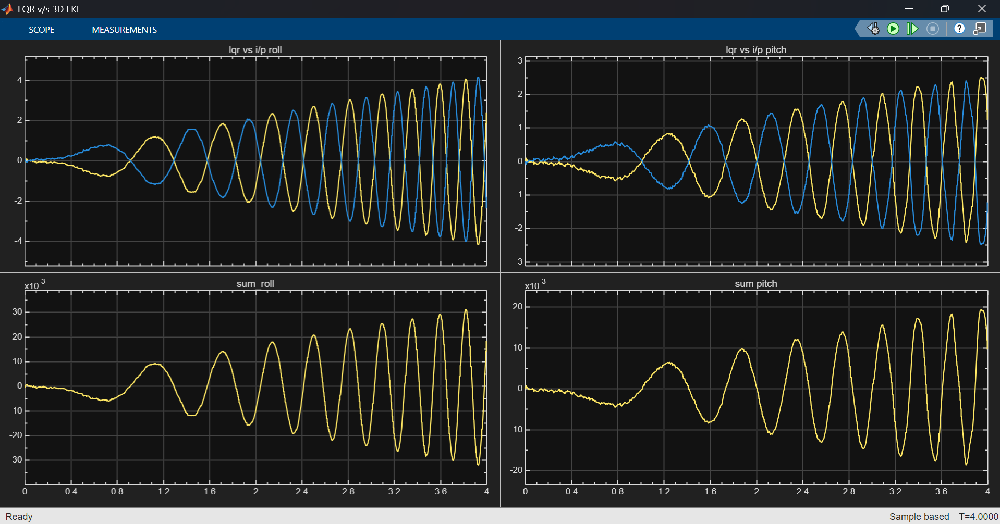
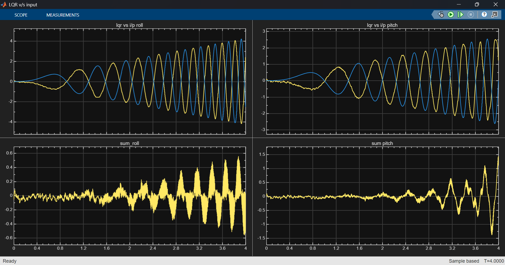

<div align="center">

# <span style="font-size:5rem; font-weight:900; letter-spacing:0.5px;">TremoSense</span>

### Adaptive Tremor Suppression and Motion Stabilization Platform

<table>
<tr>
<td width="42%" align="center">
  
</td>
<td width="1%"></td>
<td width="57%" align="center">
  
</td>
</tr>
</table>

<p align="center">
  
  
  
</p>

</div>

---

## ✨ Abstract

Neurological disorders such as Parkinson’s disease and essential tremor can impair fine motor activities including eating and object manipulation. TremoSense is a low-cost embedded tremor compensation platform that uses inertial sensing, signal processing, EKF-LQR-based feedback control, and servo actuation to reduce tremor-induced motion in real time. The system is also designed to support future tremor analytics through patient motion recording and computational assessment of tremor characteristics.

---

## 🎯 Objectives

* Real-time acquisition and monitoring of hand motion dynamics
* Identification and characterization of tremor frequency and amplitude
* Generation of active counter-motion for tremor attenuation
* Enhancement of utensil stability during assistive feeding tasks
* Facilitation of future clinician-oriented reporting and patient monitoring capabilities

---

## ⚙️ Operating Principle

The TremoSense platform integrates inertial sensing, signal processing, state estimation, and servo-based actuation into a robust tremor compensation system. The onboard IMU continuously acquires multi-axis hand motion data, which is digitally filtered to isolate pathological tremor-frequency components, typically within the 3–8 Hz range. An Extended Kalman Filter (EKF) performs motion estimation and noise reduction, while a Linear Quadratic Regulator (LQR)-based controller computes optimal compensatory control signals in real time.

These control inputs drive a two-axis servo-actuated gimbal mechanism that generates counter-directional motion to attenuate tremor-induced displacement and improve spoon stability during assistive feeding operations.

---

## 🧰 Hardware Configuration

* **Seeed XIAO nRF52840 Sense** for embedded processing and onboard IMU sensing
* **Servo motors** for two-axis stabilization control
* **Rechargeable battery subsystem** for portable operation
* **Lightweight mechanical spoon mounting assembly**

---

## 💻 Software Stack and Development Environment

* **Zephyr RTOS** for embedded firmware architecture and hardware abstraction
* **MATLAB & Simulink** for control-system modeling, simulation, and analytical validation

### Required Libraries and Installation

#### Operating System Support

The project development environment has been configured and tested to build on:

* **Ubuntu 22.04 LTS**

#### Zephyr RTOS Installation and Setup

The following setup procedure installs the Zephyr RTOS workspace, SDK, ARM toolchain, Python dependencies, and development utilities required for building and flashing the TremoSense firmware.

##### Linux Installation (Ubuntu 22.04+)

**1. Install Zephyr RTOS**

Follow the instructions [here](https://docs.zephyrproject.org/latest/develop/getting_started/index.html) till [this section](https://docs.zephyrproject.org/latest/develop/getting_started/index.html#get-zephyr-and-install-python-dependencies)

**2. Installing the Zephyr SDK**

Currently this project uses XIAO BLE Sense board which has nRF52840 SoC onboard it which requires GNU ARM toolchain. To optimize the installation of Zephyr SDK
and reduce disk usage we can install the GNU ARM toolchain specifically, uing:
```bash
west sdk install -t zephyr-arm-eabi
```
Otherwise,
```bash
west sdk install
```
installs all toolchains.

**3. Install the Tremosense Application**

```bash
cd ~/zephyrproject
git clone https://github.com/rkt-1597/Tremosense
cd Tremosense/tremosense-app
```

**4. Build the Tremosense Application**

```bash
west build -b xiao_ble/nrf52840/sense -p always -- -DDTC_OVERLAY_FILE=boards/xiao_ble.overlay -DCONF_FILE=boards/xiao_ble.conf
```

**5. Flash the Tremosense Application**

Now, double-click on the XIAO BLE Sense board and copy the file `zephyr.uf2` to XIAO-SENSE directory; board will reset immediately and start running the application. <username> is your Linux username, which can be found uinsg `whoami` command.
```bash
cp -r ~/zephyrproject/Tremosense/tremosense-app/build/zephyr/zephyr.uf2 /media/<username>/XIAO-SENSE
```
**Note:**
Just after flashing, make sure to hold the board horizontally levelled since it immediately starts calibration processs for the IMU. It will switch on onboard blue LED for 3 seconds before beginning calibration and after calibration, it will 
blink the blue LED for 5 seconds; the obtained offsets will be available on console during this time. Immdiately after this the servos will be activated for tremor cancellation.

---

## 🚀 Future Scope and Research Directions

* Adaptive control strategies for improved real-time tremor compensation
* Longitudinal tremor recording and patient-specific motion analytics
* Machine learning-based tremor characterization and severity estimation
* Automated clinician-oriented tremor analysis and reporting
* Ergonomically optimized lightweight enclosure for daily usability

---

## MATLAB & Simulink Modelling Results

* **Unit Step Response Statistics**



*Both Roll & Pitch Axes demonstrate a minimal ~6% overshoot for an unit step response*

* **Unit Step Response**

*The visual representation of the unit step response indicates the rapid reaction time and prolonged stablility*

* **System Limits (Bode Plot)**

*Bode plots of directly copuled axes (Roll Motor - Roll Angle & Pitch Motor - Pitch Angle) illustrate the system's frequency limit, highlighting a global minimum at 16.94 Hz which is greater than typical high frequency Parkinson's disease tremors (~6-7 Hz) or Essential Tremor (upto 12 Hz)*

* **Magnitude Bode Plots (Cross-Coupling)**

*Magnitude Bode plots validate strong primary axis response and effectively zero cross-coupling interference between roll and pitch.*

* **EKF vs Input**

*Scope capture demonstrates the Extended Kalman Filter (EKF) accurately tracking the simulated input signals.*

* **LQR vs EKF**

*Comparison shows the Linear Quadratic Regulator (LQR) successfully stabilizing the system based on the EKF state estimations.*

* **LQR vs Input**

*Performance plot shows the final LQR control effort actively counteracting the raw physical input to cancel out the tremor.*

## 👥 Project Contributors

<div align="center">

**Prithvi Tambewagh** · **Pawan Shinde** · **Pranshu Kumar**<br>
Department of Electronics and Telecommunication Engineering<br>
Veermata Jijabai Technological Institute (VJTI), Mumbai, India<br>

</div>